# FAQ

本文档描述使用CPUBench工具过程中常见的测试环境问题及解决方法。

# 系统时间戳引起的相关问题

CPUBench工具依赖CMake构建机制编译测试负载，在Linux环境，CMake生成Makefile脚本，通过make执行Makefile进行编译构建，在编译过程中扫描源代码文件，根据文件时间戳判断文件是否发生变化进行编译，当系统时间未设置正确时间（比如默认1970-1-1 01:01:01），而CPUBench软件包里的相关源文件的时间戳是当前时间（比如2022-3-15 01:01:01等），会导致CMake误以为文件出现变化需要重新编译，在复杂工程里容易出现编译死循环。

### 1、X264编译卡住

**现象：**

    X264编译时屏幕回显停在building，长时间停留在这处；
   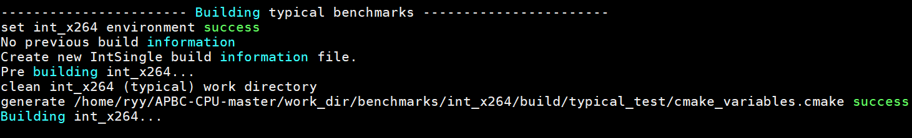

**可能原因：**

    系统时间在CPUBench工具包的时间戳之前；
   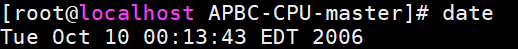

**解决方法：**

    修改系统时间到当前时间，重新运行CPUBench工具即可；

### 2、TPCC/TPCH负载编译失败

**现象：**

    运行CPUBench工具编译tpcc负载或者tpch负载时失败；
   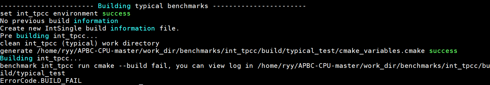


**可能原因：**

    系统时间在CPUBench工具包的时间戳之前，查看mysql本身的日志如下；
   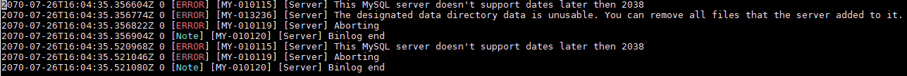

**解决方法：**

    修改系统时间到当前时间，重新运行CPUBench工具即可；

### 3、时间戳导致的其他cmake编译问题

**现象：**

    编译第一个负载就报编译错误；

**可能原因：**

    查看环境中当前时间和CPUBench工具包时间，当前时间是否在工具包的时间戳之前；
   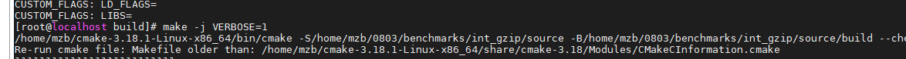

**解决方法：**

    修改系统时间到当前时间，重新运行CPUBench工具即可；


​    
# 依赖工具、编译器、JDK相关问题

### 1、源码安装cmake失败

**现象：**

	在龙芯或申威cpu架构上源码安装cmake失败，Utilities\KWIML\include\kwiml\abi.h报错，无法识别CPU架构的字节序
	# error "Byte order of target CPU unknown."

**原因：**

    低版本的cmake不支持最新的loongarch64、sw_64架构；

**解决方法：**

    使用cmake3.21版本的源码编译安装可解决龙芯的源码安装问题，申威架构需要修改abi.h文件，如下图所示：
   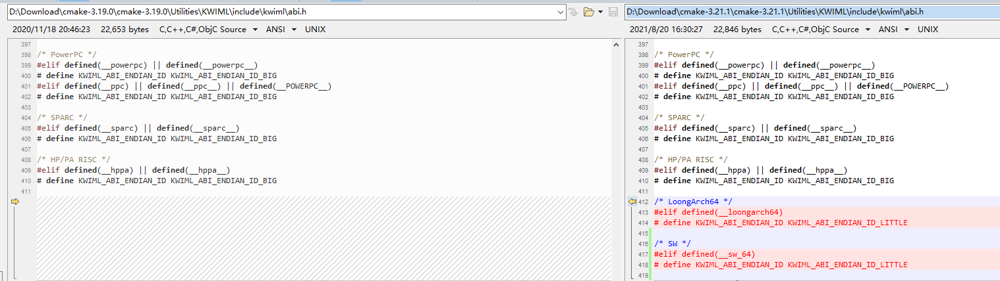

### 2、cmake自动去重问题

**现象：**

    使用类似-mllvm flag1 -mllvm flag2...类型的编译选项时，会出现编译报错 unrecognized command line option
    查看编译日志，发现实际应用的编译选项变为-mllvm flag1 flag2，丢失了第二个-mllvm导致flag2识别失败。    

**原因：**

    多个具有重复字段的编译选项时，由于cmake自身具有自动去重的机制，会造成config中传递的编译选项的字段损失，导致编译失败。

**解决方法：**

    Cmake官方方案为通过增加“SHELL:”前缀避免去重，本工具延用该方法，且由于自身逻辑要求，通过以下格式进行防去重操作
    例：
        -O3; SHELL: -mllvm flag1; -mllvm flag2; -mllvm flag3


### 3、aarch64架构OpenJDK8运行wordcount偶现测试结果异常

**现象：**

    在aarch64架构上，使用OpenJDK8运行workload时，约10%概率触发JDK的bug，导致测试时长异常增加至正常的3倍左右。

**原因：**

    这是JDK8的bug，详细请查看下面链接
    [8183543: Aarch64: C2 compilation often fails with "failed spill-split-recycle sanity check"](http://hg.openjdk.java.net/jdk9/jdk9/hotspot/rev/f739cf1a4ab8)

**解决方法：**

    使用openJDK11，或手工合入patch重新构建JDK。

### 4、java workload在使用jdk17时运行失败

**现象：**

    现有java workload(kmeans, wordcount)在使用jdk17时，运行失败

**原因：**
    
    当前java workload包含基于spark的kmeans和wordcount，选取的spark版本为spark-3.0.1，该版本需要添加额外的jdk参数才能支持jdk17（更高版本均如此）

**解决方法：**

    增加额外jdk选项: --add-opens=java.base/sun.nio.ch=ALL-UNNAMED


### 5、tpcc或其他负载使用-flto选项编译失败

**现象：**

    在配置文件添加CFLAGS/CXXFLAGS/FFLAGS=-flto，编译失败

**原因：**

    编译过程中静态库创建需要使用编译器自带AR和RANLIB工具。

**解决方法：**

    使用AR=${lang_dir}/gcc-ar，RANLIB=${lang_dir}/gcc-ranlib
    AR和RANLIB请根据当前使用编译器来指定，上述是gcc编译器的示例。 

### 4、wrf或其他负载使用-flto选项编译失败

**现象：**

    在配置文件添加FFLAGS=-flto，且配置编译器自带的AR和RANLIB后（比如gcc-ar, gcc-ranlib），编译提示BUILD_FAIL

**可能原因：**

    缺少某些未知编译选项支持，且编译选项在-O3中开启。

**解决方法：**

    使用FFLAGS=-O3 -flto

### 5、wrf编译提示参数类型不匹配

**现象：**

    使用gcc10及以上版本编译器编译wrf，编译失败


**原因：**

    gfortran 10版本以后，对代码的语法检查更严格，默认把调用参数不匹配视为Error。

**解决方法：**

    在FFLAGS字段中添加-fallow-argument-mismatch -fallow-invalid-boz编译选项。


# 测试环境不满足工具运行必要条件

CPUBench工具运行的软硬件要求：
- 工具运行需要约**2G**内存每实例
- 运行Single模式时至少需要**20G**硬盘空间，运行Concurrent模式时，每实例增加**2G**硬盘空间
- 运行时/dev/shm目录至少需要**3G**空间
- C，C++，fortran编译器，cmake（版本>`3.14.1`）构建工具，JDK（Java8版本以上）

### 1、内存不足，多实例运行过程中卡死

**现象：**

	多实例运行TPCC或者TPCH负载时卡死；

**可能原因：**

	负载设计原则是每个负载单实例的内存占用可以在2G以内，多实例下服务器内存不够；

**解决方法：**

    查看环境中内存空间大小，估算多实例需要的内存大小，为服务器增加足够的内存条之后再次运行；

### 2、编译器版本低引起编译错误

**现象：**

    编译负载时（例如gromacs，tpcc，tpch等）出现编译错误，打开debug日志后搜索error查看具体错误信息如下；
   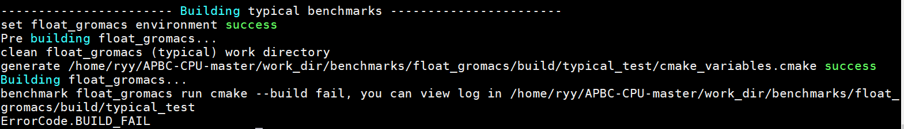

   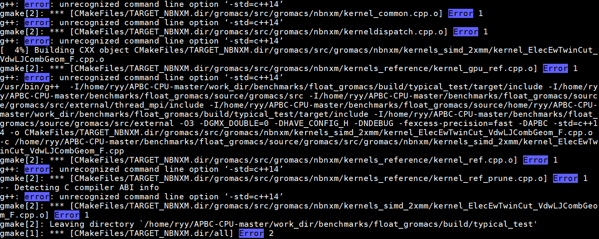

**可能原因：**

    查看环境中当前的gcc版本和配置文件中配置的编译器路径，有些负载使用了c++14，需要5.3.0以上版本的gcc编译器；
   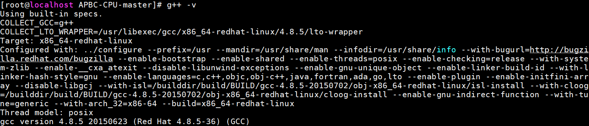

   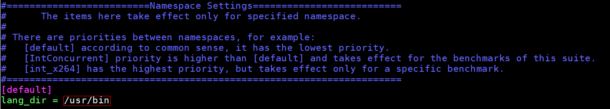

**解决方法：**

    升级当前环境中的gcc版本，或者如果当前环境中存在符合条件的高版本gcc，在配置文件里配置其二进制文件所在路径；


​    
# 系统环境变量配置引起的相关问题

### 1、环境变量LC_ALL导致工具提示UnicodeEncodeError

**现象：**

```
运行CPUBench工具时，终端提示UnicodeEncodeError；
```

   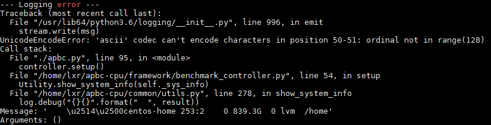

**可能原因：**

```
环境变量LC_ALL的值设定为'C'；
```

**解决方法：**

```
执行'export LC_ALL='，将该环境变量置空，重新运行CPUBench工具即可。
```

### 2、编译报错，提示lib库不存在

**现象：**

    运行CPUBench工具编译nektar负载时提示libxxx.so库不存在，实际环境中存在该lib库；
   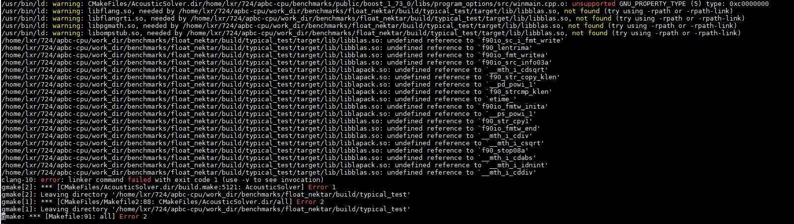

   

    运行CPUBench工具编译wrf负载成功，运行时提示libxxx.so库不存在，实际环境中存在该lib库；
   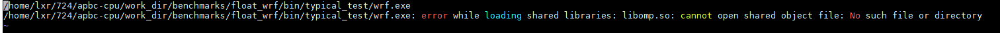

   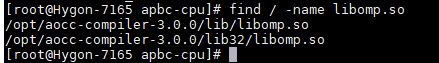

   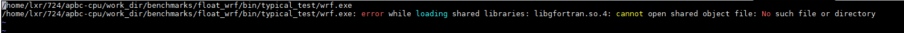

   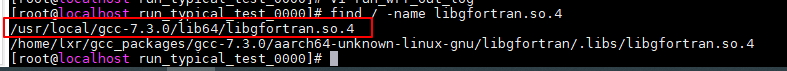

**可能原因：**

    系统未配置LD_LIBRARY_PATH环境变量；

**解决方法：**

    将所使用编译器的lib库路径配置到LD_LIBRARY_PATH中，重新运行CPUBench工具即可；

### 3、TPCC/TPCH负载编译失败，提示“Unsupported platform”

**现象**

```
运行tpcc/tpch时，cmake_build_out_log提示“Unsupported platform”
```


**可能原因：**

```
系统未配置LD_LIBRARY_PATH环境变量；
```

**解决方法：**

```
将所使用编译器的lib库路径配置到LD_LIBRARY_PATH中，重新运行CPUBench工具即可；
```

### 4、TPCC/TPCH负载编译失败，提示“sys_gettid was not declared in this scope”

**分析：**

```
cd work_dir/benchmarks/int_tpcc/build/typical_test进入编译目录
查看cmake_build_out_log日志文件得到的提示“sys_gettid was not declared in this scope”可能并不是根因，需要进一步分析CMake的详细日志
cd CMakeFiles
打开CMakeError.log和CMakeOutput.log文件查看更详细的构建信息
比如在这个案例里看到这个错误提示"error while loading shared libraries:libatomic.so.1:cannot open shared objec"
```

**解决方法：**

```
yum install libatomic
```
