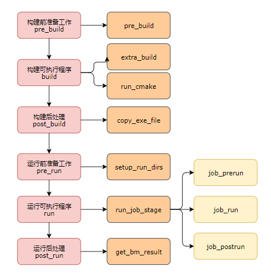
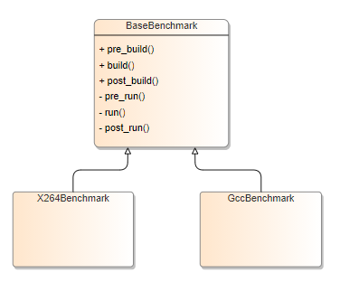

# 新增benchmark集成指导

---
## 一、 概述

---
### 1、总体设计

CPUBench由运行框架和benchmark测试程序组成，运行框架根据用户输入配置（通过配置文件或命令行参数）编译、构建、运行各benchmark测试程序，并生成测试报告。支持C、C++、Java语言构建benchmark程序，以组件形式管理，各组件相互独立，实现标准的组件接口。

---
### 2、 运行流程

运行流程图:



benchmark的执行流程主要分为构建（build）和运行（run）两个阶段
<br>
build阶段
+ pre_build():
  + 初始化构建目录等准备操作
  + prepare_build(): 基类提供抽象，子类实现,为满足自身需求的额外准备操作
+ build(): 
  + build_extend_tool(): 基类提供抽象，子类实现，构建额外的可执行程序（如benchmark x264的ffmpeg等）
  + run_cmake()：构建benchmark主要的运行程序
+ post_build():
  + 进行构建后的可执行文件拷贝、输出文件解析等操作

run阶段
+ pre_run():
  + setup_run_dirs(): 初始化运行目录等操作
+ run():
  + run_job_stage()：多进程运行执行器，在每个job目录下都会执行, 根据stage执行以下三个阶段
    + run_job_before(): 进行benchmark运行前准备工作，如生成数据等
    + run_job(): 进行benchmark程序的运行
    + run_job_after(): 进行benchmark运行结束后的处理工作，如结果验证等
+ post_run():
  + get_bm_result(): 进行结果收集等操作

---

### 3、benchmark组件化设计
框架以组件化形式管理benchmark，待开发的benchmark组件均需要继承于父类`BaseBenchmark`, 父类实现编译、运行等主要流程，子类为编译构建相关的属性赋值，根据需求实现`BaseBenchmark`提供的抽象方法， 快速实现各benchmark的集成。

CPUBench benchmark类继承关系如下图：




每个benchmark是一个组件，在项目的目录结构上分配对应名称的文件夹，其中包含继承于`BaseBenchmark`类的benchmark具体实现类（xxx.py）、 工程源代码、测试输入数据、输出校验数据等，测试数据又分test、train、refconcurrent不同模式下使用的测试数据（这部分待定）

---
## 二、Benchmark类结构

### 1、抽象基类AbstractBenchmark

  `AbstractBenchmark`为所有Benchmark的抽象类，类中仅包括基础属性和抽象方法

+ abstract类图：
  <table>
  <th>class AbstractBenchmark</th>
  <tr><td>
  +   name <br>
  +   option <br>
  +   result <br>
  +   ...
  </td></tr>
  <tr><td>
  +   pre_build()<br>
  +   build()<br>
  +   post_build()<br>
  +   pre_run()<br>
  +   run()<br>
  +   post_run()<br>
  +   ...
  </td></tr>
  </table>

### 2、BaseBenchmark类

  `BaseBenchmark`继承于`AbstractBenchmark`, 配置、编译构建、运行、收集结果等基本功能在`BaseBenchmark`中实现, **Benchmark子类编写时需要关注的属性和方法如下:**

+ 基础属性
  <table class="method">
  <tr><th>属性名</th><th>属性描述</th><th>默认值</th><th>阶段</th><th>子类必须override</th>
  <tr><td><code>_target_exe</code></td><td>Benchmark的主程序</td><td>空字符串</td><td>运行</td><td>是</td>
  <tr><td><code>_extend_tools</code></td><td>需要额外构建的可执行程序集合</td><td>空元组</td><td>运行</td><td>否</td>
  <tr><td><code>_reftime</code></td><td>基准机器运行时间，最终结果将与其计算出一个比值</td><td>空字典</td><td>运行</td><td>是</td>
  <tr><td><code>_parallel_build</code></td><td>并行编译开关</td><td>False</td><td>运行</td><td>否</td>
  <tr><td><code>_make_variable</code></td><td>编译信息实例，管理编译所需的变量（详见其他基础数据结构）</td><td>False</td><td>运行</td><td>否</td>

+ 公共方法
  <table class="method">
  <tr><th>方法名</th><th>参数描述</th><th>功能描述</th></tr>
  <tr><td><code>pre_build()</code></td><td>无</td><td>负责构建前的准备工作</td></tr>
  <tr><td><code>build()</code></td><td>无</td><td>负责构建工作</td></tr>
  <tr><td><code>post_build()</code></td><td>无</td><td>负责构建后的构建信息收集和目标文件拷贝等工作</td></tr>
  <tr><td><code>pre_run()</code></td><td>无</td><td>负责Benchmark运行前的准备工作</td></tr>
  <tr><td><code>run()</code></td><td>无</td><td>负责Benchmark运行</td></tr>
  <tr><td><code>post_run()</code></td><td>无</td><td>负责运行后的结果收集和处理等工作</td></tr>
  </table>

+ 子类可override的方法

  对于一些复杂的benchmark，在不同阶段需要特别的处理，可通过钩子方法实现，比如，通过其他工具预处理输入数据, 测试结果的校验等。`BaseBenchmark`提供以下的可重载方法进行高级定制：

  <table class="method">
  <tr><th>方法名</th><th>参数描述</th><th>功能描述</th><th>子类必须override</th></tr>
  <tr><td><code>_prepare_build(self)</code></td><td>无</td><td>基类仅提供抽象, 子类实现, 满足子类在构建准备阶段时的特殊需求</td><td>否</td></tr>
  <tr>
  <td><code>_build_extend_tool(self)</code></td>
  <td>无</td>
  <td>基类仅提供抽象，子类实现，子类可以使用该方法构建自身所需的额外可执行程序</td>
  <td>否</td>
  </tr>
  <tr>
  <td><code>_run_job_before(self, job)</code></td>
  <td>job：Job对象</td>
  <td>基类仅提供抽象，子类实现，用于执行数据生成相关操作</td>
  <td>否</td>
  </tr>
  <tr>
  <td><code>_run_job_after(self, job)</code></td>
  <td>job: Job对象</td>
  <td>基类仅提供抽象，子类实现，用于结果验证相关操作</td>
  <td>否</td>
  </tr>
  <tr>
  <td><code>_generate_job_command(self, job)</code></td>
  <td>job: Job对象</td>
  <td>基类仅提供抽象，子类实现，用于返回benchmark程序运行的命令</td>
  <td>是</td>
  </tr>
  </table>

+ 工具接口

  由benchmark基类提供，子类可根据自身需求使用
  <table>
  <tr><th>方法名</th><th>参数描述</th><th>功能描述</th></tr>
  <tr>
  <td>_run_command(self, command, log_dir)</td>
  <td>command：Command对象<br>log_dir：生成日志的目录，默认为Command对象的execution_dir，也可以手动指定</td>
  <td>命令执行器，根据Command对象中的信息使用subprocess模块执行命令，并在指定目录中生成日志文件</td>
  </tr>
  <tr>
  <td>_copy_src_dir(self, original_dir, dst_dir)</td>
  <td>original_dir：文件的原始目录<br>dst_dir：拷贝文件的目标目录</td>
  <td>将需要构建的源文件拷贝到work_dir中对应的构建目录下</td>
  </tr>
  </table>

### 3、benchmark子类

benchmark子类继承BaseBenchmark类，提供编译和运行所必要的信息，子类可以重写基类所提供的抽象方法，来满足自身构建、运行流程中特殊需求，设计思路可参考后文集成示例(example和x264)。


### 4、其他基础数据结构
+ #### `Command类`
    构造函数：
  ```python
     def __init__(self, execution_title, execution_command, args=None, execution_dir=None):
        self.execution_title = execution_title # 记录每个命令执行的title，用于日志文件命名
        self.execution_command = execution_command # 可执行程序的命令
        self.args = args # 执行参数
        self.execution_dir = execution_dir # 在哪一个目录中执行命令
  ```
+ #### `Job类`：Benchmark实例运行时的状态信息
    构造函数：
  ```python
     def __init__(self, index):
        self.index = index # job的id
        self.result = None # job运行的结果信息
  ```
+ #### `MakeVariable类`: 控制编译信息
  构造函数：
  ```python
    def __init__(self):
        # make variables from benchmark itself
        self.target_exe = []
        self.language = []
        self.source = []
        self.bench_include_dirs = []
        self.bench_flags = []
        self.custom_flags = {} # 自定义选项
        ... 
        self.bench_extra_libs = []
        # make variables from config
        self.optimize = [] # 优化选项，来自配置文件
        ...
  ```     
        
---

## 三、benchmark 编译
  cpubench采用cmake对benchmark执行程序的编译，通过提供模块化的控制文件进行编译控制。

  &emsp;&emsp;目前框架支持两种方式集成benchmark的编译

  &emsp;&emsp;1. 使用框架提供的cmake编译模板

  &emsp;&emsp;2. 使用自身的规范化cmake脚本

+ #### 使用框架提供的cmake编译模板
  
    cpubench框架提供了模块化的编译脚本，分为三个文件：
        
    + hook_builtin_target_decl.cmake 变量声明文件，负责定义、组装编译所用的变量
    
    + hook_builtin_target_buildctrl.cmake 编译控制文件，负责编译、链接等处理
    
    + hook_builtin_target_impl.cmake cmake接口文件，负责输出编译的信息供框架使用 
    
    使用时将三个文件include到源文件目录下的CMakeLists.txt脚本中即可，注意，decl.cmake文件（以下均省略前缀）由于是变量的声明，因此需要放置于编译脚本的开始部分，另外，impl文件中的输出需要的decl中声明的变量，它需要decl.cmake文件首先被包含。编译模板通过benchmark子类获取编译信息，为此，我们设置了MakeVariable类去处理benchmark所需的编译信息。
  
    MakeVariable类中的benchmark自身设置的编译信息如下：
  
        * target_exe：要编译的目标文件(改属性在子类中已经声明，MakeVariable实例中会获取子类中的属性值)
        * language：使用的语言(同上)
        * source：源文件列表
        * bench_include_dirs：头文件搜索路径
        * bench_flags/bench_cflags/bench_cxxflags：编译选项 
        * bench_extra_libs：链接所需的lib(库名即可，如math库则设置为"m")
        * custom_flags: 自定义编译选项
    这些信息框架会将其封装为SET(var_name var_val)的形式，写入到各benchmark编译目录中的cmake_variable.cmake文件中，由decl.cmake包含该文件从而实现传参效果。
  
    ##### 样例：CMakeLists.txt编写

        将上述三个文件include到CMakeList.txt中即可
        样例：X264的CMakeList.txt
            cmake_minimum_required(VERSION 3.14.1)
            project(int_concurrent_x264)
            include(../../hook_builtin_target_decl.cmake)
            include(../../hook_builtin_target_buildctrl.cmake)
            include(../../hook_builtin_target_impl.cmake)


+ #### 使用自身规范化的cmake脚本
    
    使用自身编译脚本，则需要对语法进行规范，目的在于，框架需要将来自于配置文件等的编译信息传递并应用到benchmark的构建中。
    
    需要benchmark自身提供的cmake脚本具有以下规范：
    1. 请确保工程中的cmake脚本尽量不要出现CMAKE_C_FLAGS等全局设置语句，原因有二：
        
        a. 全局设置类型的语句操作不当会导致变量被覆盖
        
        b. 框架遵循modern cmake的风格，因此传递的变量也为target_compile_options()等cmake target系列接口所需的格式。
       （cmake target系列接口的输入为cmake中的列表形式，而CMAKE_C_FLALGS是字符串形式，因此使CMAKE_C_FLALGS时无法应用框架传递的编译相关变量）
    2. 请使用modern cmake的风格编写cmake脚本，如target_compile_options()、target_link_libraries()、target_link_options()
    3. 如果有多个目标有依赖关系（编译先后顺序），请注意add_dependencies的使用
    4. 框架中的需要传递的变量仍包含在decl.cmake文件中，请在编译脚本中包含decl.cmake以及impl.cmake文件，否则将无法编译。
    5. 传递的参数可根据需要自行在子类中赋值并使用，如果需要特定的参数，可在MakeVariable类中的custom_flags变量中设置，最终也会以SET(var_name var_value)的形式包含在decl.cmake文件中
       
    ##### 样例：CMakeLists.txt编写
            include(../../hook_builtin_target_decl.cmake)
            add_library()
            target_compile_options(target public ${FINAL_CFLAGS})
            target_link_libraries(target public ${FINAL_LIBS})
            ...
            add_executable()
            ...
            include(../../hook_builtin_target_impl.cmake)   

---

## 四、**benchmark集成步骤**


### 1. 模块化精简工程代码，并使用cmake进行编译构建

### 2. 根据框架组件的目录结构组织代码、数据

### 3. 编写继承于BaseBenchmark的benchmark子类

### 4. 注册benchmark

### 5. 测试验证


---
## 五、benchmark集成样例


根据不同benchmark的需求，下面介绍结构简单（example）和结构复杂（x264）两个样例

---
### 编写样例1：benchmark example

1. #### 模块化精简工程代码，并使用cmake进行编译构建
   
   工程本身使用cmake进行编译构建,使用为C++编写，源文件目录下包含include和src文件夹，src目录下的main.cpp为程序入口，功能简单，仅调用了helloworld.cpp中的sayHello()函数，sayHello函数功能为向文件中写入字符串。
2. #### 根据框架组件的目录结构组织代码、数据
   工程源码的include和src文件夹放在source目录下，添加__init__.py文件定义python包，并进行workload的注册。
   + example目录结构：
     
          |-- int_concurrent_example
              |--source
                  |-- include
                       |-- helloworld.h
                  |-- src
                       |-- helloworld.cpp
                       |-- main.cpp
                  |-- CMakeLists.txt

3. #### 编写继承于BaseBenchmark的benchmark子类
   
    + 定义main_exe, reftime以及SOURCES(源文件信息)等编译相关的属性
    + 由于example无其他额外构建和数据处理，因此只需实现generate_job_command()方法来生成可执行程序example的执行命令即可
    + example子类代码结构:
        <table>
        <th>class ExampleBenchmark</th>
        <tr><td>
        -   main_exe <br>
        -   reftime <br>
        -   LANG <br>
        -   BENCH_INCLUDE_DIRS <br>
        -   parallel_build <br>
        -   bench_build_info <br>
        </td></tr><tr><td>
        -   generate_job_command : return tuple
        </td></tr>
        </table>
      
   + 子类override的属性
     + self._main_exe：example的可执行程序名
     + self._reftime：基准机器运行时间，最终结果将与其计算出一个比值
     + 编译相关的属性：用于生成CMake编译脚本所需要的变量信息文件
   + 子类override的方法
      + _generate_job_command(self, job: Job)
        + 构造执行命令command
        + 使用执行器执行命令并返回bool值
   + <a href="#example子类详细代码">example子类详细代码</a>
    <a id="返回example"></a>
   
4. #### 注册benchmark
   
    子类编写完成后，需要对benchmark进行注册，对于benchmark组件，测试框架通过Python语言的装饰器机制，在导入时自动注册到BenchmarkManager，由框架进行统一调度控制
    ```python
      from benchmarks.base_benchmark import BaseBenchmark
      from benchmarks.manager import BenchmarkManager
      
      @BenchmarkManager.register_benchmark(int_example)
      class ExampleBenchmark(BaseBenchmark):
          def __init__(self, name, option):
              super().__init__(name, option)
    ```
    另外，需要在cpubench_root/benchmarks/__init__.py中添加新增的benchmark子类信息,如：
   ```python
    from .int_x264.x264 import X264Benchmark
    from .int_gcc.gcc import GccBenchmark
    ```
   还需要在cpubench_root/common/var_common.py中将新增benchmark加入到测试套定义中
   ```python
    class BenchmarkSuite:
        INT_CONCURRENT = "IntConcurrent"
        INT_SINGLE = "IntSingle"
        FLOAT_CONCURRENT = "FloatConcurrent"
        FLOAT_SINGLE = "FloatSingle"
        BENCHMARK_SUITE = {
            INT_CONCURRENT: ("int_x264",),
            INT_SINGLE: ("int_x264",),
            FLOAT_CONCURRENT: ("float_lightgbm",),
            FLOAT_SINGLE: ("float_lightgbm",)
        }
        CONCURRENT = (INT_CONCURRENT, FLOAT_CONCURRENT)
        SINGLE = (INT_SINGLE, FLOAT_SINGLE)
    ```
5. #### 测试验证

---
### 编写样例2：x264

+ 简介:
  
  x264是一款视频压缩软件，在CPUBench中，x264 benchmark的执行分为了三个阶段
    1. 使用解压缩软件ffmpeg对原始视频文件进行解压缩，生成x264的输入文件
    2. 使用x264对输入文件进行压缩(只对该步骤应用编译选项和计时)
    3. 使用可执行程序ImageEvalutor对压缩结果进行校验
  
  由于其本身的特点和当前的裁剪，x264 benchmark具备相当的特殊性，基本覆盖所有子类的接口使用。根据基类baseBenchmark类中的run方法定义，执行分为三个阶段，run_job，run_job_before和run_job_after，三者均为多进程执行（根据job数量），在每个job目录中进行操作。其中run_job由框架控制，是每个benchmark必有的阶段, 子类需要使用_generate_job_command()方法返回run_job所需的命令，而run_job_before和run_job_after，基类均只实现抽象接口，由子类根据需要自行实现，如无需求，则无需关注。
  对于x264，其数据生成需要在每个job目录下调用ffmpeg进行解压缩(run_job_before)生成输入文件，结果验证需要对每个job目录中的输出文件进行对比验证
  
  + BaseBenchmark的run方法
    ```
    |-- run 运行benchmark程序，多job时使用多进程在每个job目录下运行
          |-- run_job_stage 多进程运行执行器，在每个job目录下都会执行，根据stage执行以下三个阶段
              |--run_job_before 进行生成数据等操作
              |--run_job 进行benchmark程序的运行
              |--run_job_after 进行benchmark结果验证等操作
    ```

+ x264步骤集成如下：

1. 模块化精简工程代码，并使用cmake进行编译构建
    
    X264选取0.161.x版本的官方源码，源码由C语言编写，由configure文件来组织编译。通过源码configure文件的命令行选项可以过滤掉不需要的编译文件和宏，接着根据Make编译过程提取必要的.c和.h文件，并保留编译选项的最小集，将这些信息记录到x264.py中。因为x264直接通过源码可编译出可执行程序，无需额外的链接库，也没有编译依赖关系，因此CmakeLists.txt中直接引用默认模板即可。
   
2. 根据框架组件的目录结构
   
   x264通过pass1和pass2两次压缩来实现更好的压缩效果，原始的输入文件是压缩后的.264文件，位于int_concurrent_x264/data/input下。在workload执行的准备阶段，通过ffmpeg来进行解压缩，获取x264的输入yuv文件，经过第二次压缩后，CPUBench通过修改x264代码，会提取出经过解压缩的11帧图像，CPUBench将这11帧图像与压缩前的对应帧（存放在int_concurrent_x264/data/进行比对， 比对程序是CPUBench自研的ImageEvaluator程序。x264/ffmpeg/ImageEvaluator均位于int_concurrent_x264/source下。
    + x264 目录结构
       ```
          |-- int_concurrent_x264
              |-- data
                  |-- refconcurrent
                      |-- compare
                      |-- input
              |-- source
                  |-- ffmpeg
                  |-- ImageEvalutor
                  |-- x264
                  |-- CMakeLists.txt
              |-- x264.py
       ```
    
3. 编写继承于BaseBenchmark的benchmark子类 
    + 定义main_exe, reftime以及SOURCES(源文件信息)等编译相关的属性
    + 进行额外的构建：x264需要额外编译ffmpeg和ImageEvalutor，通过实现_build_extend_tool()进行编译
    + 进行数据生成：x264需要使用ffmpeg解压缩原始视频文件，通过实现run_job_before()来使用ffmpeg进行解压缩
    + 生成x264可执行程序的命令：通过实现generate_job_command()来生成命令集合
    + 结果校验：在使用x264压缩成功后，需要校验压缩结果是否正确，通过实现run_job_after()来进行结果验证
    + x264代码结构
      <table>
      <th>class X264Benchmark</th>
      <tr><td>
      -   main_exe <br>
      -   main_exe <br>
      -   reftime <br>
      -   LANG <br>
      -   BENCH_INCLUDE_DIRS <br>
      -   BENCH_FLAGS <br>
      -   BENCH_EXTRA_LIBS <br>
      -   bench_build_info <br>
      -   parallel_build <br>
      </td>
      </tr>
      <tr>
      <td>
      -   generate_job_command : return tuple <br>
      -   build_extend_tool：return bool <br>
      -   run_job_before： return bool <br>
      -   run_job_after： return bool <br>
      -   generate_job_command:    return  bool <br>
      </td>
      </tr>
      </table>

    + 子类override的属性
      + self._main_exe：x264的可执行程序名 
      + self._extend_tools：x264需要额外进行构建的可执行程序ffmpeg、ImageEvalutor
      + self._reftime：基准机器运行时间，最终结果将与其计算出一个比值 
      + 编译相关的属性，用于生成CMake编译脚本所需要的变量信息文件
    
    + 子类override的方法
      + build_extend_tool(self): 构建ffmpeg和ImageEvalutor
        + self._copy_src_dir(original_dir, ffmpeg_build_dir)：由于ffmpeg当前使用makefile进行编译，因此将源码目录下的文件全部拷贝到work_dir中的build/ffmpeg目录下
        + 构造执行命令的command
        + 使用执行器执行命令并返回bool值（表示构建成功/失败）
      + _run_job_before(self, job: Job): 进行数据生成, 在x264中为使用ffmpeg解压缩原始视频文件，生成x264的输入文件
        + 构建执行命令command
        + 使用执行器执行命令并返回bool值（表示构建成功/失败）
      + _run_job_after(self, job: Job): 进行结果验证, 在x264中为使用ImageEvalutor对x264的输出结果进行验证
        + 构建执行命令command
        + 使用执行器执行命令并返回bool值（表示构建成功/失败）
      + _generate_job_command(self, job: Job): 返回x264 测试所需要执行的命令集合
        + 构建执行命令元组commands并返回
          （注：该方法返回值为由Command对象构成的元组，这是因为某些benchmark，如x264本身，需要传入不同的参数来执行两次x264） 
      
    + <a href="#x264子类详细代码">x264子类详细代码</a>
      <a id="返回x264"></a>
4. #### 注册Benchmark
      ```python
        from benchmarks.base_benchmark import BaseBenchmark
        from benchmarks.manager import BenchmarkManager

        @BenchmarkManager.register_benchmark(int_x264)
        class X264Benchmark(BaseBenchmark):
            def __init__(self, name, option):
                super().__init__(name, option)
      ```

-----
## 六、代码附录

#### <a id="example子类详细代码"></a>  <br> <a href="#返回example">返回</a>
代码见目录benchmark/int_concurrent_example/example
+ example代码
    ``` python
    @BenchmarkManager.register_benchmark('int_concurrent_example')
    class ExampleBenchmark(BaseBenchmark):
        EXAMPLE = 'example'

        def __init__(self, name, option):
            super().__init__(name, option)
            # example的可执行文件名
            self._main_exe = ExampleBenchmark.EXAMPLE
            # 基准机器运行时间，最终结果将与其计算出一个比值
            self._reftime = {
                'test': 1,
                'train': 1,
                'ref': 1
            }
            # 编译相关信息
            self._LANG = BenchmarkLanguage.CPP
            self._SOURCES = ['src/helloworld.cpp', 'src/main.cpp']
            self._BENCH_INCLUDE_DIRS = 'include'
            # 需要将上面用到的字段写入到_bench_build_info列表中
            self._bench_build_info = ("LANG", "SOURCES", "BENCH_INCLUDE_DIRS")
        
        def _generate_job_command(self, job: Job) -> tuple:
            job_dir = os.path.join(self._run_dir, "run_%s_%s_%04d" % (self._tune, self.option.tag, job.index))
            commands = [Command('run_example', os.path.join(self._bin_dir, 'example'), execution_dir=job_dir)]
            return tuple(commands)
    ``` 

---
#### <a id="x264子类详细代码"></a> <br> <a href="#返回x264">返回</a>
x264代码见目录benchmark/int_concurrent_x264/x264.py
+ x264代码
    ``` python
    @BenchmarkManager.register_benchmark('int_concurrent_x264')
    class X264Benchmark(BaseBenchmark):

        IMAGE_EVALUATOR = "ImageEvaluator"
        FFmpeg = "ffmpeg"
        X264 = "x264"

        def __init__(self, name, option):
            super().__init__(name, option)
            # x264的可执行程序名
            self._main_exe = X264Benchmark.X264
            # benchmark x264需要额外进行构建的可执行程序ffmpeg、ImageEvalutor
            self._extend_tools = (X264Benchmark.FFmpeg, X264Benchmark.IMAGE_EVALUATOR)
            # 是否并行编译
            self._parallel_build = True
            # 基准机器运行时间，最终结果将与其计算出一个比值
            self._reftime = {
                'test': 500,
                'train': 1000,
                'ref': 4229
            }
            # 编译相关信息
            self._LANG = BenchmarkLanguage.C
            self._SOURCES = [SOURCE_FILES]
            self._BENCH_INCLUDE_DIRS = "x264_src"
            self._BENCH_FLAGS = "-DAPBC -DHIGH_BIT_DEPTH=0 -DBIT_DEPTH=8 -D_GNU_SOURCE -std=gnu99"
            self._BENCH_LD_FLAGS = ""
            self._BENCH_EXTRA_LIBS = "m dl"
            # 需要将上面用到的字段写入到__bench_build_info列表中
            self._bench_build_info = ("LANG", "SOURCES", "BENCH_INCLUDE_DIRS",
                                      "BENCH_FLAGS", "BENCH_EXTRA_LIBS", "BENCH_LD_FLAGS")
        
        # 构建ffmpeg和ImageEvalutor
        def _build_extend_tool(self) -> bool:
            """
            build ffmpeg and ImageEvaluator
            """
            original_dir = os.path.join(self._source_dir, X264Benchmark.FFmpeg)
            ffmpeg_build_dir = os.path.join(self._build_dir, X264Benchmark.FFmpeg)
            # 由于ffmpeg当前使用makefile进行编译，因此将源码目录下的文件全部拷贝到work_dir中的build/ffmpeg目录下
            self._copy_src_dir(original_dir, ffmpeg_build_dir)
            image_evaluator_build_dir = os.path.join(self._build_dir, X264Benchmark.IMAGE_EVALUATOR)
            d_h = "-H%s" % os.path.join(self._source_dir, X264Benchmark.IMAGE_EVALUATOR)
            d_b = "-B%s" % image_evaluator_build_dir
            # 构造执行命令的Command对象集合
            commands = (
                Command(
                    "ffmpeg_configure",
                    "./configure",
                    args=["--disable-x86asm", "--disable-decoders", "--enable-decoder=h264",
                          "--disable-encoders", "--enable-encoder=rawvideo", "--disable-muxers",
                          "--enable-muxer=rawvideo", "--disable-protocols", "--enable-protocol=file",
                          "--disable-filters", "--disable-demuxers", "--enable-demuxer=h264", "--disable-outdevs",
                          "--disable-indevs", "--disable-bsfs", "--disable-hwaccels", "--disable-parsers",
                          "--enable-parser=h264", "--disable-mmi", "--disable-optimizations", "--disable-asm"],
                    execution_dir=ffmpeg_build_dir),
                Command(
                    "ffmpeg_make",
                    "make",
                    args=["-j%s" % self._cpu_count],
                    execution_dir=ffmpeg_build_dir),
                Command(
                    "ImageEvaluator_cmake",
                    "cmake",
                    args=["cmake", d_b, d_h],
                    execution_dir=image_evaluator_build_dir),
                Command(
                    "ImageEvaluator_build",
                    "cmake",
                    args=["--build", image_evaluator_build_dir],
                    execution_dir=image_evaluator_build_dir)
            )
            # 使用执行器执行命令， 返回bool值
            for command in commands:
                if not BaseBenchmark._run_command(command):
                    return False
            return True
        # 进行数据生成操作，运行ffmpeg对原始数据文件进行解压缩，生成x264程序的输入数据文件
        def _run_job_before(self, job: Job) -> bool:
            """
            use ffmpeg to decode compressed data files
            """
            # 构造command对象
            job_dir = os.path.join(self._run_dir, "run_%s_%s_%04d" % (self._tune, self.option.tag, job.index))
            command = Command("run_ffmpeg", os.path.join(self._bin_dir, X264Benchmark.FFmpeg),
                              ['-i', os.path.join(job_dir, 'Traffic.264'), os.path.join(job_dir, 'Traffic.yuv')], job_dir)
            # 使用执行器执行命令
            if not BaseBenchmark._run_command(command, job_dir):
                return False
            # 返回bool值，表示数据生成成功/失败
            return True
        # 执行结果校验程序ImageEvalutor
        def _run_job_after(self, job: Job) -> bool:
            """
            use ImageEvalutar to decode compressed data files
            """
            # 构造command对象集合
            job_dir = os.path.join(self._run_dir, "run_%s_%s_%04d" % (self._tune, self.option.tag, job.index))
            postrun_args = (['arg0', 'arg1'],['arg2', 'arg3'])
            commands = [Command("run_ImageEvalutor", os.path.join(self._bin_dir, X264Benchmark.IMAGE_EVALUATOR),
                                args, job_dir) for args in postrun_args]
            # 使用执行器执行所有的命令
            for command in commands:
                if not BaseBenchmark._run_command(command):
                    return False
            # 返回bool值，表示结果校验成功/失败
            return True
        
        # 生成x264程序执行所需的命令
        def _generate_job_command(self, job) -> tuple:
            # 构造command对象的元组  
            job_dir = os.path.join(self._run_dir, "run_%s_%s_%04d" % (self._tune, self.option.tag, job.index))
            run_args = (['arg0', 'arg1'], ['arg2', 'arg3'])
            commands = [Command('run_x264', os.path.join(self._bin_dir, 'x264'), args, job_dir) for args in run_args]
            return tuple(commands)
    
    ```

---


## Q&A

---
+ Q：如果有额外的构建程序，应该放哪里？
    + A：work_dir中，benchmark对应的目录下的bin目录将存放_main_exe和所有列在_extend_tools集合中的可执行文件
+ Q：如果有要调用的脚本文件，应该放哪里？
    + A：如要调用脚本文件，将脚本文件置于benchmarks/对应的benchmark目录/source下，目录层次可以自行组织，在构造Command实例时拼接正确即可
+ Q：为什么有的benchmark的build/testmode_tag/目录下有多个目录，而有的却没有？
    + A: build/testmode_tag/目录下的目录是按照benchmark是否具有_extend_tools属性来进行初始化的，目的是为了让不同程序的构建能在单独的目录下执行，而如果你没有设置_extend_tools（或者是不需要），那么默认的构建目录将为build/testmode_tag/（只有一个程序需要构建，该目录就是他的专属构建目录）
+ Q：我要怎么拼接目录？
    + A：基类中给出了对应目录的属性，比如:
        ```
        benchmarks/XXXX/source：self._source_dir
        benchmarks/XXXX/data: self._data_dir
        work_dir/benchmarks/XXXX/bin/tunemode_tag: self._bin_dir
        work_dir/benchmarks/XXXX/build/tunemode_tag: self._build_dir
        work_dir/benchmarks/XXXX/run: self._run_dir
        ```
